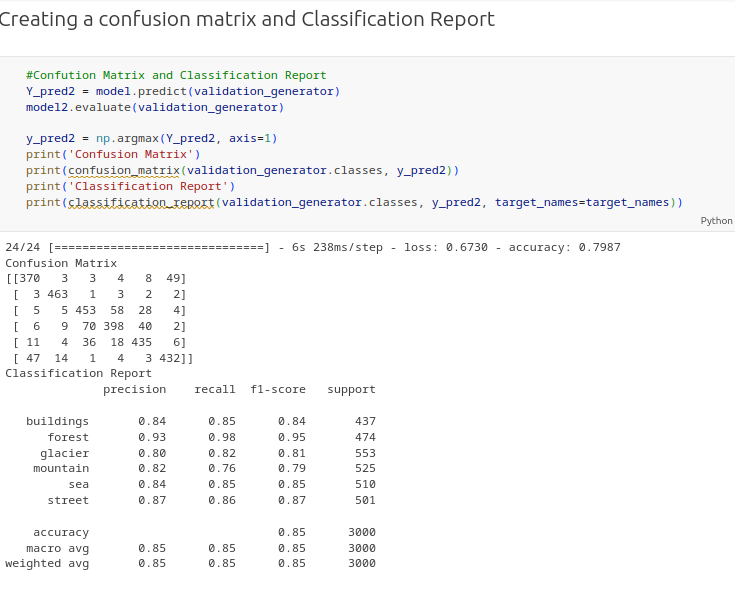

# A Convolutional Neural Network Image Classifier

The convolutional neural network model helps classify images into different classes. For this specific project, the model helped classify images into six main classes. These include forests, glaciers, streets, mountains, buildings, and the sea. Thus, the model was fed with a variety of scenery images which it was supposed to predict their specific classes. To develop the model, several key aspects and features were utilized such as TensorFlow and Open-Source Computer Vision library to process the data
Dataset: The dataset used in the project was retrieved from the Kaggle website as indicated by the instructor. The dataset was 363 Mb with around 14 thousand images in the train folder, three thousand in the test folder, and seven thousand in the prediction folder.

## Model Classification and Implementation

For the successful implementation of the model, various key functions and modules were employed. One is the use of data augmentation to increase various transformation features of the images. The use of CNN helps recognize images, classify, and differentiate them. And importantly, the use of TensorFlow as a tool to help develop the model.

## Visualization

Several visualizations were done during the development of the model to ensure effective creation as well as make one able to visualize its objective. For instance, the visualization below shows the successful load and transformation of the data

## Model Prediction and Results

After a successful development, the model did achieve various objectives. First, the training of the model helped it achieve 85.03% accuracy. This was key, in ascertaining that the model was effective for prediction. Both the confusion matrix and the classification report have been illustrated below.

Figure: Confusion Matrix and the Classification Report
Additionally, a transfer learning model was established to help compare the model. In this model, various features were adjusted such as the use of batch normalization and filters among many others. However, the number of neurons and layers was constantly maintained. Notably, there was a slight decrease the accuracy level of the resultant model that was only noted on the model evaluation but not in the classification report. This has been illustrated below.

## Conclusion

With the successful development of the convolutional neural network image classifier, the model achieved an approximate 85% accuracy level. Thus, the model would classify various images with an 85% accuracy level.
